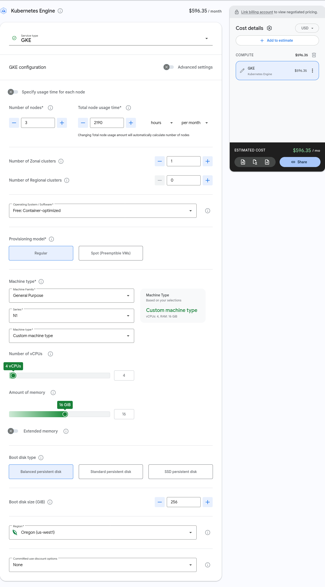
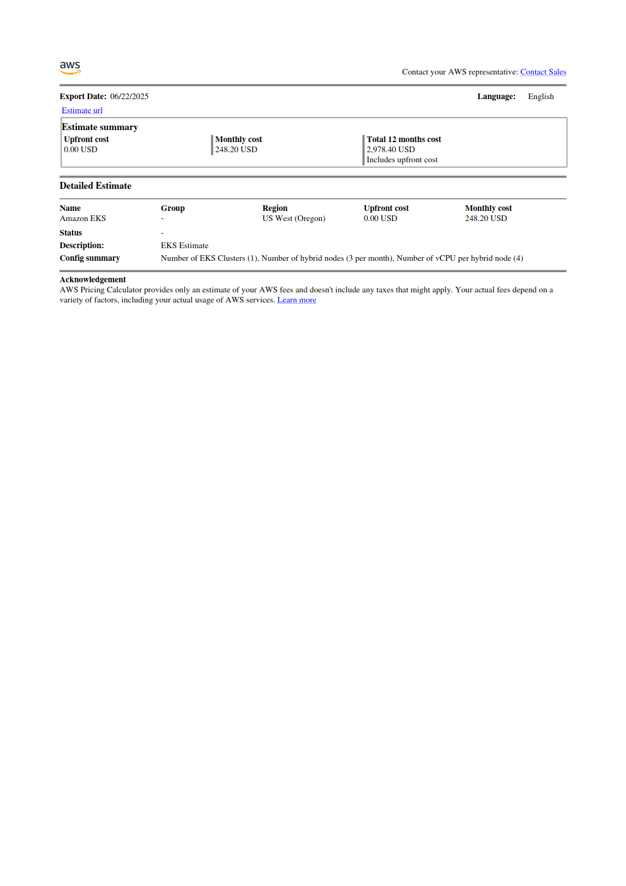

This blog is an attempt to document the process of building a Kubernetes
cluster using commodity hardware and some basic automation. The reason
the author is embarking on this voyage of dubious value is that he
requires a cluster with which to keep his skills sharp and despite
a local network with some twenty or more servers that includes primary
and secondary bind name servers, there are no systems presently available
to the author for repurposing as nodes in a Kubernetes cluster.

## Why not minikube or kind

There are a couple of reasons for this. The first is that, while kind or
minikube may be fine tools for a beginner that just wants to get their
feet wet with Kubernetes, anyone with enough experience will be able to
tell you that simulating a cluster is a wildly different activity from
actually running a cluster. Since the author intends to demonstrate
and expand expertise in the operation of Kubernetes clusters in the
enterprise it follows that he'll need a proper cluster to operate on.

If you've read much of the Kubernetes reference manual, you may have noticed
that the use of cloud services is [encouraged](https://kubernetes.io/docs/setup/production-environment/#production-considerations).
The author certainly did when he first started thumbing through it back in 2018.
Being the sort of curious, pedantic, and contrarian sort of fellow
that reads the sound advice provided by the manual to just do it the easy way
as a challenge instead of advice the author built his first Kubernetes cluster
the hard way in 2018.

The manual was correct its assertion that knowing how to build a cluster
isn't necessarily useful in a production environment since (as the author
now has the experience to verify) an engineer will almost never be working
with bare metal in the wild. You just have to take it on faith that whichever
provider you're making do with has configured things correctly on their end.
And, when you're being paid to make the software run, this is fine. After all,
the alternative is to introduce the possibility of having to visit an actual
data center back into your life, and who wants that?

Still, the author is a curious monkey and he has an almost uncontrollable desire
to know how things work, even if only to support some future act of pedantry.

And, because the Kubernetes API is a forever changing and immensely complicated
system, building bare metal clusters on his local network has become something
of a habit for the author.

### Also, money

So the author finds himself without the means to support the cost of a
modest
[GKE](https://cloud.google.com/products/calculator?dl=CjhDaVF5WkRRd1pEZGtZUzA1TWpreUxUUTVZVFF0WWpSaU5TMWtPVEl4T1RNNE5HVTBZVGtRQVE9PRAPGiRDMkMwRjlBOS1GMjNFLTQ2RTMtQjZDMS0zN0ZDMkJEMDQ4QjY)
or [EKS](https://calculator.aws/#/estimate?id=8a9dd9e17e7d31f7a717c6759ae6ab4eef2ed112)
cluster but the need for a cluster on which to experiment and study
while at the same time having managed to consume every single node
he'd used to build his last half dozen or so bare metal clusters for
other services that he's come to rely on. In the way that a hammer
will always want a nail, the author finds himself in need of some
additional nodes.

[]

At least Google is honest about the cost of this modest cluster.

[]

AWS can't even tell you how much you're going to pay for a similarly
modest cluster in any believable or precise way. Rest assured, though,
that for the same configuration provided by Google the figure quoted here
would at least double if not triple for an EKS cluster.

Yikes!
